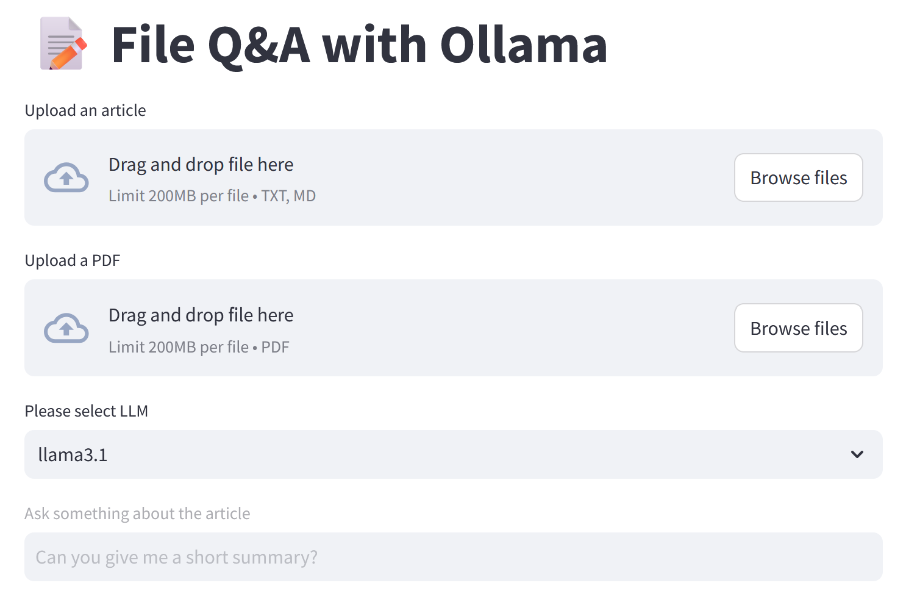

# Offline File Q&A Powered by Ollama and Streamlit

- Ask question to your document completely offline and free (because we're using open-source models).
- (Actually, at this point we only can ask **one question** to **one file** through the app, more feature coming soon.)
- For more accurate answer, please consider modifying the prompt to your specific use by using examples, or other prompt engineering techniques.



## Note
This is the continuation from my [last learning](https://github.com/RiaAyuP/streamlitchat1) to make a Streamlit Chat app. I wanted to make the File Q&A as well, but I already set the Python environment there to be 3.10. Unfortunately the File Q&A feature from Streamlit requires Python 3.11. Therefore, I set a separate repo for this function only. For those who wants to combine this with the Chat functionality, be sure to use **Python 3.11** or above.

## Preparation
1. Install Ollama in your PC, please read [Ollama Documentation](https://github.com/ollama/ollama).
3. Download open-source LLMs into your PC, in this case `gemma2`, `llama3.1`, and `mistral` with `ollama pull <llm-name>` command.

## How to Run
### Clone the repository
Project repo:
```bash
https://github.com/RiaAyuP/ollamarag
```
### Create a conda environment after opening the repository
```bash
conda create -p env python=3.11 -y
```
```bash
conda activate ./env
```

### Install the requirements
```bash
pip install -r requirements.txt
```

### Make `.gitignore` file
Add `env` folder  to your `.gitignore` file.

### Run the chatbot application
```bash
streamlit run fileqa.py
```

## References
1. [Streamlit LLM Examples](https://llm-examples.streamlit.app/)
2. [My Streamlit Chat Github](https://github.com/RiaAyuP/streamlitchat1)