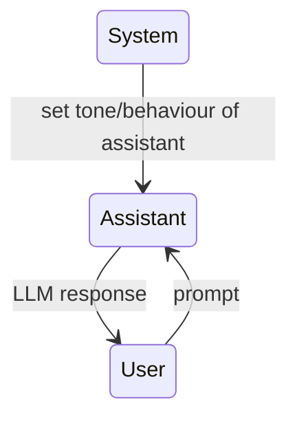
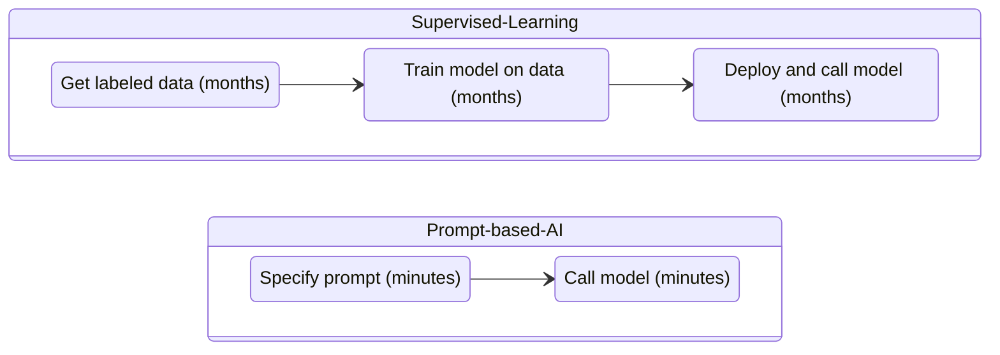
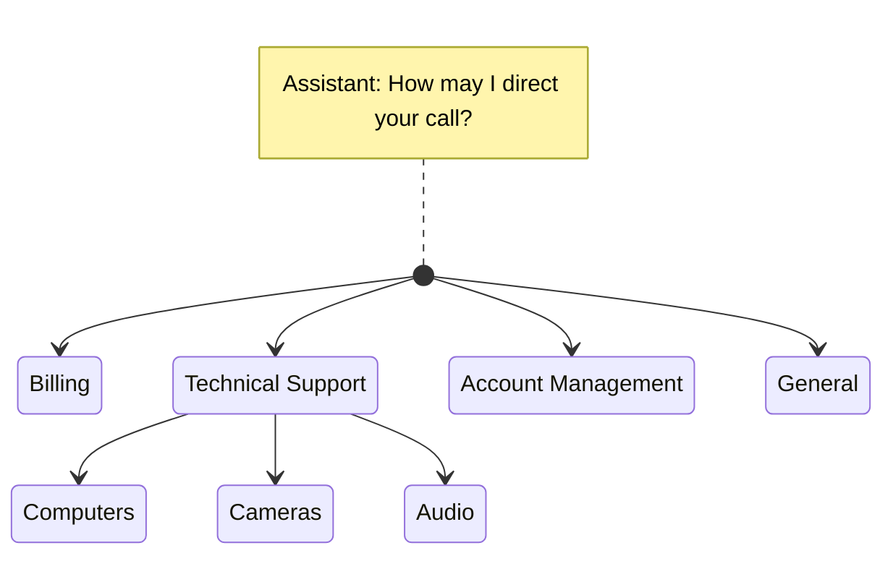

# Building Systems with ChatGPT API

# About this course

In Building Systems with ChatGPT API, you will learn how to automate complex workflows using chain calls to a large language model. Unlock new development capabilities and improve your efficiency in this brand new short course.

You’ll build:

- Chains of prompts that interact with the completions of prior prompts.
- Systems where Python code interacts with both completions and new prompts.
- A customer service chatbot using all the techniques from this course.

You’ll learn how to apply these skills to practical scenarios, including classifying user queries to a chat agent’s response, evaluating user queries for safety, and processing tasks for chain-of-thought, multi-step reasoning.

This one-hour course, taught by Isa Fulford (OpenAI) and Andrew Ng ([DeepLearning.AI](http://deeplearning.ai/)), builds on the lessons taught in the popular ChatGPT Prompt Engineering for Developers, though it is not a prerequisite.

Hands-on examples make each concept easy to understand. Built-in Jupyter notebooks allow you to seamlessly experiment with the code and prompts presented in the course.

# Language Model, the Chat Format, and Token

## Supervised Learning

Example: restaurant reviews’ sentiment classification

| Input X | Input Y |
| --- | --- |
| The pastrami was great! | Positive |
| Service was slow and the food was so-so. | Negative |
| The earl grey tea was fantastic. | Positive |
| Best pizza I’ve ever had! | (Guess) —> Positive |

## Large Language Model

A language model is built by using supervised learning (x→y) to repeatedly predict the next word.

| Input X | Output Y |
| --- | --- |
| My favorite food is a | bagel |
| My favorite food is a bagel | with |
| My favorite food is a bagel with | cream |
| My favorite food is a bagel with cream | cheese |

**Two types of large language models (LLMs)**

- Base LLM: Predicts next word, based on text training data
- Instruction-tuned LLM: Tries to follow instructions

| Base LLM | Instruction-tuned LLM |
| --- | --- |
| What is the capital of France? | What is the capital of France? |
| What is France’s largest city?
What is France’s population?
What is the currency of France? | The capital of France is Paris. |

**Getting from a Base LLM to an instruction-tuned LLM**

- Fine-tune on examples of where the output follows an input instruction
- Obtain human-ratings of the quality of different LLM outputs, on criteria such as whether it is helpful, honest, and harmless
- Tune LLM to increase probability that it generates the more highly rated outputs (using RLHF: Reinforcement Learning from Human Feedback)

## Code: OpenAI Chat Completions

```python
import os
import openai
from dotenv import load_dotenv, find_dotenv
_ = load_dotenv(find_dotenv())

openai.api_key  = os.environ['OPENAI_API_KEY']
```

```python
client = openai.OpenAI()

def get_completion(prompt, model="gpt-3.5-turbo"):
	messages = [{"role": "user", "content": prompt}]
	response = client.chat.completions.create(
    	model=model,
    	messages=messages,
    	temperature=0
	)
	return response.choices[0].message.content
```

```python
response = get_completion("What is the capital of France?")
print(response)
```

<aside>
➡️ The capital of France is Paris.

</aside>

## Tokens

- For English language input, 1 token is around 4 characters, or ¾ of a word.
- Common words usually amount to one token, e.g. learning, new, things, is, fun are one token each.
- Less common word such as prompting is three tokens, where it is divided to prom, pt, ing. Another example is lollipop which is divided to l, oll, ipop. (That’s why LLM gives the wrong answer when asked to reverse the word “lollipop”.
- Different models have different limits on the number tokens in the input ‘context’ and output ‘completion’. For GPT-3.5-turbo it is about 4000 tokens.

```python
response = get_completion("Take the letters in lollipop and reverse them")
print(response)
```

<aside>
➡️ pilpolol

</aside>

```python
response = get_completion("Take the letters in l-o-l-l-i-p-o-p and reverse them")
response
```

<aside>
➡️ 'p-o-p-i-l-l-o-l’

</aside>

## System, User, and Assistant Messages

```python
messages = [
{"role": "system", "content": "Your response must be one sentence long."},
{"role": "user", "content": "Write me a story about a happy carrot."},
]
```



## Code: Ultimate Helper Function and Token Counter

```python
#### besides importing os, openai, and dotenv as done before
import tiktoken

#### define the parameters beforehand
model = "gpt-3.5-turbo"
temperature = 0 # degree of randomness
max_tokens = 500

#### ultimate helper function
def get_completion_and_token_count(messages, model, temperature, max_tokens):
		response = client.chat.completions.create(
				model=model,
				messages=messages,
				temperature=temperature,
				max_tokens=max_tokens,				
		)
		content = response.choices[0].message.content
		token_dict = {
				'prompt_tokens': response['usage']['prompt_tokens'],
				'completion_tokens': response['usage']['completion_tokens'],
				'total_tokens': response['usage']['total_tokens'],
		}
		return response, token_dict
```

```python
messages = [
{'role':'system', 'content':"You're an assistant who responds in Dr Seuss's style."},    
{'role':'user', 'content':"Write me a very short poem about a happy carrot"},  
]
response, token_dict = get_completion_and_token_count(messages)
```

```python
print(response)
```

<aside>
➡️ Oh, happy carrot in the ground so deep,
With vibrant colors you brightly leap.
Your leaves sway in the breeze so light,
A joyful sight, a lovely sight!

In the garden you may be small,
But your happiness is great above all.
So keep on growing, little carrot friend,
Your happiness will never end!

</aside>

```python
print(token_dict)
```

<aside>
➡️ {'prompt_tokens': 37, 'completion_tokens': 44, 'total_tokens': 81}

</aside>

Prompting is revolutionizing AI application development.



# Evaluate Inputs

## Classification

Delimiter such as ‘####’ is important to (1) classify different parts of the conversation and (2) easily truncate the parts that will not be shown to the user, so the user (e.g. customer using the chatbot) will only see the important parts.

```python
delimiter = "####"
system_message = f"""
You will be provided with customer service queries. The customer service query will be delimited with {delimiter} characters.
Classify each query into a primary category and a secondary category.
Provide your output in json format with the keys: primary and secondary.

Primary categories: 
....[fill in the data]...
Primary category's secondary categories:
....[fill in the data]...
etc.
"""
user_message = "I want you to delete my profile and all of my user data"
messages =  [
	{'role':'system', 'content': system_message},
	{'role':'user', 'content': f"{delimiter}{user_message}{delimiter}"},  
]
response = get_completion_from_messages(messages)
```

## Moderation

Please refer [here](https://platform.openai.com/docs/guides/moderation).

# Process Inputs

## Chain of Thoughts Reasoning

```python
delimiter = "####"
system_message = f"""
Follow these steps to answer the customer queries.
The customer query will be delimited {delimiter}.

Step 1:{delimiter} First decide whether the user is asking a question about a specific product or products. Product category doesn't count.

Step 2:{delimiter} If the user is asking about specific products, identify whether the products are in the following list.
All available products:
1. Product: TechPro Ultrabook
   Category: Computers and Laptops
   Brand: TechPro
   Model Number: TP-UB100
   Warranty: 1 year
   Rating: 4.5
   Features: 13.3-inch display, 8GB RAM, 256GB SSD, Intel Core i5 processor
   Description: A sleek and lightweight ultrabook for everyday use.
   Price: $799.99

2. Product: BlueWave Gaming Laptop
   Category: Computers and Laptops
   Brand: BlueWave
   Model Number: BW-GL200
   Warranty: 2 years
   Rating: 4.7
   Features: 15.6-inch display, 16GB RAM, 512GB SSD, NVIDIA GeForce RTX 3060
   Description: A high-performance gaming laptop for an immersive experience.
   Price: $1199.99

3. Product: PowerLite Convertible
   Category: Computers and Laptops
   Brand: PowerLite
   Model Number: PL-CV300
   Warranty: 1 year
   Rating: 4.3
   Features: 14-inch touchscreen, 8GB RAM, 256GB SSD, 360-degree hinge
   Description: A versatile convertible laptop with a responsive touchscreen.
   Price: $699.99

4. Product: TechPro Desktop
   Category: Computers and Laptops
   Brand: TechPro
   Model Number: TP-DT500
   Warranty: 1 year
   Rating: 4.4
   Features: Intel Core i7 processor, 16GB RAM, 1TB HDD, NVIDIA GeForce GTX 1660
   Description: A powerful desktop computer for work and play.
   Price: $999.99

5. Product: BlueWave Chromebook
   Category: Computers and Laptops
   Brand: BlueWave
   Model Number: BW-CB100
   Warranty: 1 year
   Rating: 4.1
   Features: 11.6-inch display, 4GB RAM, 32GB eMMC, Chrome OS
   Description: A compact and affordable Chromebook for everyday tasks.
   Price: $249.99

Step 3:{delimiter} If the message contains products in the list above, list any assumptions that the user is making in their message e.g. that Laptop X is bigger than Laptop Y, or that Laptop Z has a 2 year warranty.

Step 4:{delimiter}: If the user made any assumptions, figure out whether the assumption is true based on your product information.

Step 5:{delimiter}: First, politely correct the customer's incorrect assumptions if applicable. Only mention or reference products in the list of 5 available products, as these are the only 5 products that the store sells. Answer the customer in a friendly tone.

Use the following format:
Step 1:{delimiter} <step 1 reasoning>
Step 2:{delimiter} <step 2 reasoning>
Step 3:{delimiter} <step 3 reasoning>
Step 4:{delimiter} <step 4 reasoning>
Response to user:{delimiter} <response to customer>

Make sure to include {delimiter} to separate every step.
"""
```

```python
user_message = "by how much is the BlueWave Chromebook more expensive than the TechPro Desktop"

messages =  [  
{'role':'system', 'content': system_message},    
{'role':'user',  'content': f"{delimiter}{user_message}{delimiter}"},  
]

response = get_completion_from_messages(messages)
print(response)
```

<aside>
➡️ Step 1:#### This is a comparison question between two specific products.
Step 2:#### The BlueWave Chromebook is priced at $249.99 and the TechPro Desktop is priced at $999.99.
Step 3:#### The assumption made is that the BlueWave Chromebook is more expensive than the TechPro Desktop.
Step 4:#### The assumption is incorrect. The TechPro Desktop is actually more expensive than the BlueWave Chromebook by $750.
Response to user:#### The TechPro Desktop is actually more expensive than the BlueWave Chromebook by $750.

</aside>

```python
try:
	final_response = response.split(delimiter)[-1].strip()
except Exception as e:
	final_response = "Sorry, I'm having trouble right now, please try asking another question."
    
print(final_response)
```

<aside>
➡️ The TechPro Desktop is actually more expensive than the BlueWave Chromebook by $750.

</aside>

## Chaining Prompts

**The advantages of chaining prompts**

- More focused
    - Easier to test by including human in the loop
- Context limitations
    - Skip some chains of the workflow when not needed for the task
    - Easier to test by including human in the loop
    - Easier to keep track of state external to the LLM (in your own code), especially for complex tasks
- Reduced cost
    - Reduce number of tokens used in a prompt
    - Use of external tools (web search, databases)



```python
products = {
	"TechPro Ultrabook": {
    	"name": "TechPro Ultrabook",
    	"category": "Computers and Laptops",
    	"brand": "TechPro",
    	"model_number": "TP-UB100",
    	"warranty": "1 year",
    	"rating": 4.5,
    	"features": ["13.3-inch display", "8GB RAM", "256GB SSD", "Intel Core i5 processor"],
    	"description": "A sleek and lightweight ultrabook for everyday use.",
    	"price": 799.99
	},
#### …etc…
}
```

```python
def get_product_by_name(name):
    return products.get(name, None)

def get_products_by_category(category):
    return [product for product in products.values() if product["category"] == [category]
```

```python
print(get_product_by_name("TechPro Ultrabook"))
```

<aside>
➡️ {'name': 'TechPro Ultrabook', 'category': 'Computers and Laptops', 'brand': 'TechPro', 'model_number': 'TP-UB100', 'warranty': '1 year', 'rating': 4.5, 'features': ['13.3-inch display', '8GB RAM', '256GB SSD', 'Intel Core i5 processor'], 'description': 'A sleek and lightweight ultrabook for everyday use.', 'price': 799.99}

</aside>

```python
category_and_product_response_1 = get_completion_from_messages(messages)
```

<aside>
➡️ [
{'category': 'Smartphones and Accessories'},
{'category': 'Cameras and Camcorders'},
{'category': 'Televisions and Home Theater Systems'}
]

</aside>

Note that it has a string type of object.

```python
import json 

def read_string_to_list(input_string):
    if input_string is None:
        return None

    try:
        input_string = input_string.replace("'", "\"")  # Replace single quotes with double quotes for valid JSON
        data = json.loads(input_string)
        return data
    except json.JSONDecodeError:
        print("Error: Invalid JSON string")
        return None

```

```python
category_and_product_list = read_string_to_list(category_and_product_response_1)
print(category_and_product_list)
```

<aside>
➡️ [{'category': 'Smartphones and Accessories'}, {'category': 'Cameras and Camcorders'}, {'category': 'Televisions and Home Theater Systems'}]

</aside>

```python
def generate_output_string(data_list):
    output_string = ""

    if data_list is None:
        return output_string

    for data in data_list:
        try:
            if "products" in data:
                products_list = data["products"]
                for product_name in products_list:
                    product = get_product_by_name(product_name)
                    if product:
                        output_string += json.dumps(product, indent=4) + "\n"
                    else:
                        print(f"Error: Product '{product_name}' not found")
            elif "category" in data:
                category_name = data["category"]
                category_products = get_products_by_category(category_name)
                for product in category_products:
                    output_string += json.dumps(product, indent=4) + "\n"
            else:
                print("Error: Invalid object format")
        except Exception as e:
            print(f"Error: {e}")

    return output_string
```

```python
product_information_for_user_message_1 = generate_output_string(category_and_product_list)
```

```python
system_message = f"""
You are a customer service assistant for a large electronic store. Respond in a friendly and helpful tone, with very concise answers. Make sure to ask the user relevant follow up questions.
"""

user_message_1 = f"""
tell me about the smartx pro phone and the fotosnap camera, the dslr one. Also tell me about your tvs"""

messages =  [  
{'role':'system',
 'content': system_message},   
{'role':'user',
 'content': user_message_1},  
{'role':'assistant',
 'content': f"""Relevant product information:\n\
 {product_information_for_user_message_1}"""},   
]

final_response = get_completion_from_messages(messages)

print(final_response)
```

<aside>
➡️ The SmartX ProPhone is a powerful smartphone with a 6.1-inch display, 128GB storage, 12MP dual camera, and 5G capability priced at $899.99. The FotoSnap DSLR Camera features a 24.2MP sensor, 1080p video, 3-inch LCD, and interchangeable lenses priced at $599.99. Our TVs include the CineView 4K TV (55-inch, 4K resolution, HDR, Smart TV, $599.99), CineView 8K TV (65-inch, 8K resolution, HDR, Smart TV, $2999.99), and CineView OLED TV (55-inch, 4K resolution, HDR, Smart TV, $1499.99). Is there a specific feature or aspect you would like more information on?

</aside>

# Evaluation

**Rule-of-thumb**

1. Evaluate on some queries
2. Harder test cases
    1. Identify queries found in production, where the model is not working as expected.
3. Modify the prompt to work on the hard test cases
4. Evaluate the modified prompt on the hard tests cases
5. Regression testing: verify that the model still works on previous test cases
    1. Check that modifying the model to fix the hard test cases does not negatively affect its performance on previous test cases.
6. Gather development set for automated testing
7. Evaluate test cases by comparing to the ideal answers
8. Run evaluation on all test cases and calculate the fraction of cases that are correct